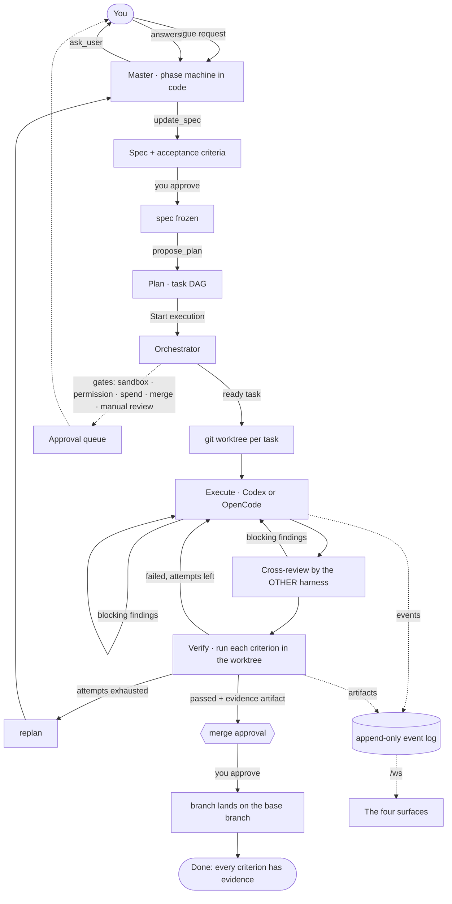

# Nexestra

Nexestra is a control center for agentic work: it turns a vague request into a
spec with acceptance criteria you can actually check, then plans the work and
drives coding harnesses — Codex, OpenCode — until every criterion has been
proved by running it. A Master agent (Claude Opus 5) does the clarifying,
planning and supervising; an orchestrator gives each task its own git worktree,
has a *second* harness review the result, runs the acceptance criteria itself,
retries with the failure attached, and stops at a merge you approve. It is
local-first: one Node process on your machine, a browser SPA, a SQLite file, and
nothing else.

Start with [`docs/index.md`](docs/index.md) if you want the guided tour, or
[`docs/ARCHITECTURE.md`](docs/ARCHITECTURE.md) for what exists today.

## Quickstart (60 seconds)

Requirements: **Node >= 24** (developed on 24.19) and **pnpm 11**
(`corepack enable` picks up the pinned `packageManager`).

```bash
pnpm install
pnpm dev
```

Open **<http://localhost:5173>**. The first run creates `~/.nexestra/nexestra.db`
and applies the migrations. It starts empty: add a workspace from the `+` in the
left rail, pointing it at a **git repository** on your machine.

Want the whole loop without spending anything? Nexestra ships a scripted
stand-in harness that writes real files into the real worktrees, so the diff,
the commit and the verification commands all see a tree that genuinely changed:

```bash
NEXESTRA_FAKE_HARNESS=1 pnpm dev
```

Then, as you add credentials, more of it becomes real:

| You have | What runs |
|----------|-----------|
| nothing | The demo Master (a script) plans; the simulated harness "executes" |
| `ANTHROPIC_API_KEY` (or `ANTHROPIC_AUTH_TOKEN`) | Claude Opus 5 is the Master |
| `codex` on `PATH`, after `codex login` | Real Codex runs the tasks |
| `opencode` too, after `opencode auth login` | The full loop: Opus plans, Codex executes, OpenCode cross-reviews |

The key is read from the **server's** environment and never reaches the browser
— only *whether* one is set does. Harness auth is each harness's own business;
`GET /api/harnesses` reports what `discover()` found (for OpenCode that means
`GET /provider` returning at least one connected provider), and
**Settings → Detected harnesses → [Refresh detection]** re-runs it after you
install or authenticate one.

Two more switches worth knowing:

```bash
NEXESTRA_SEED_MOCK=1 pnpm dev     # load demo content into an empty database
NEXESTRA_HARNESSES=codex pnpm dev # one adapter ⇒ no cross-review ⇒ no second model billed
```

## The four surfaces

| # | Surface | What it is |
|---|---------|------------|
| 1 | **Workspace / Chat** | The conversation with the Master, streaming live: clarifying questions, the spec as it is written, the plan preview, tool calls, and the orchestrator's progress interleaved by time |
| 2 | **Task Board** | The plan as a kanban — TODO / IN PROGRESS / DONE (plus REVIEW and BLOCKED when occupied) — with the harness, model, attempts, cost and merge state on each card, and `[Start execution]` / `[Pause]` / `[Cancel]` in the header |
| 3 | **Editor / Agent workspace** | One run from three angles: its worktree file tree, a file in CodeMirror, the unified diff against the branch it was cut from, and its event stream in a terminal |
| 4 | **Memory Graph** | What the Master decided and learned, as typed nodes and edges, editable |

Plus **Settings** (`⌘,`): detected harnesses, the Master runtime it started
with, defaults, budget, concurrency, theme. `⌘1`…`⌘4` switch surfaces, `⌘/`
focuses the composer, `⌘K` is the command palette.

The approval queue lives in the navigation column with a count badge on the
rail, visible from every surface — a gate blocks a run wherever you happen to be
looking.

## How the loop works



Two rules hold the whole thing up. The **phase machine is code, not prompt** —
the model only ever sees the tools its current phase allows. And **verification
runs commands**: a criterion passes because the orchestrator executed it in the
worktree and captured the exit code, never because the harness said so.

## Environment

| Variable | Default | Meaning |
|----------|---------|---------|
| `NEXESTRA_PORT` | `4242` | Server port (Vite's proxy target too) |
| `NEXESTRA_HOST` | `127.0.0.1` | Server bind address — keep it local |
| `NEXESTRA_HOME` | `~/.nexestra` | Where `nexestra.db`, `data/` and `worktrees/` live |
| `NEXESTRA_DEV` | unset | `1` forces the redirect-to-Vite behaviour (set by the server's `dev` script) |
| `NEXESTRA_WEB_DEV_URL` | `http://localhost:5173` | Where dev-mode non-API requests are redirected |
| `NEXESTRA_SEED_MOCK` | unset | `1` loads the demo fixtures into an empty database (same as `--seed-mock`) |
| `NEXESTRA_FAKE_HARNESS` | unset | `1` (or `true`) replaces every harness with the scripted stand-in |
| `NEXESTRA_HARNESSES` | all | Comma-separated ids to register: `codex`, `opencode`, `acp`, `fake` |
| `NEXESTRA_MASTER_LLM` | auto | `demo` or `anthropic`; otherwise decided by whether a key is present |
| `ANTHROPIC_API_KEY` / `ANTHROPIC_AUTH_TOKEN` | unset | The Master's credentials. Never sent to the browser |
| `NEXESTRA_LIVE_CODEX` | unset | `1` runs the opt-in Codex live tests |
| `NEXESTRA_LIVE_CODEX_MODEL` | adapter default | Model for those |
| `NEXESTRA_LIVE_OPENCODE` | unset | `1` runs the opt-in OpenCode live tests |
| `NEXESTRA_LIVE_OPENCODE_MODEL` | `openai/gpt-5.4-mini` | Model for those |
| `NEXESTRA_E2E_PORT` | `4282` | Port the Playwright suite's server listens on |
| `NEXESTRA_E2E_KEEP` | unset | `1` keeps the scratch home, repo and server log after an e2e run |
| `NEXESTRA_E2E_EXECUTION` | unset | `1` opts into `e2e/tests/execution.spec.ts` |

## Scripts

| Command | Effect |
|---------|--------|
| `pnpm dev` | Server on `127.0.0.1:4242` + Vite on `127.0.0.1:5173`, both watching |
| `pnpm build` | `vite build` for the SPA, an esbuild bundle for the server |
| `pnpm start` | Run the built server, serving the built SPA from `4242` |
| `pnpm test` | Vitest across every package — unit, contract and integration |
| `pnpm typecheck` | `tsc --noEmit` in every package, including `e2e` |
| `pnpm lint` / `pnpm lint:fix` | Biome check (lint + format + import order) |
| `pnpm format` | Biome format only |
| `pnpm e2e` | `pnpm build`, then the Playwright suite |
| `pnpm e2e:only` | Skip the build; `pnpm e2e:browsers` installs Chromium; `pnpm e2e:report` opens the last report |
| `pnpm --filter @nexestra/storage db:generate` | Regenerate `drizzle/` **and** re-embed the SQL into `src/migrations.ts` |

`pnpm test` is green on a machine with no Codex, no OpenCode and no API key —
**472 passing, 6 skipped** across 10 packages. The 6 skips are live tests behind
the opt-in variables above.

## Repo layout

```
nexestra/
  apps/
    server/                 # Hono REST + ws WebSocket over the store
      src/routes/           # one file per resource group
      src/master/           # the Master runtime: runner, host, store, demo model
      src/execution/        # the orchestrator wired up: registry, runtime, files
    web/                    # React 19 SPA — the four surfaces
      src/shell/            # rail, navigation, surface frame, keyboard, palette, approvals
      src/surfaces/{chat,board,editor,memory}/
      src/settings/         # the Settings route
      src/lib/              # TanStack Query hooks, the /ws client, Zustand, formatting
  packages/
    core/                   # zod domain schemas, HarnessAdapter contract, events, wire formats
    ui-kit/                 # terminal-like components + design tokens
    storage/                # Drizzle schema, event store, commands, replay, seeding
    master/                 # the Master agent: phases, tools, spec + plan (a library)
    orchestrator/           # the dispatch / review / verify loop (a library)
    adapters/codex/         # `codex exec --json`
    adapters/opencode/      # `opencode serve` + SSE
    adapters/fake/          # the scripted stand-in
  e2e/                      # Playwright, against the built app on a real server
  fixtures/                 # recorded harness output for the contract tests
  docs/                     # see docs/index.md
```

Workspace packages are consumed as TypeScript source (`main: ./src/index.ts`).
Vite aliases them, `tsx` transpiles them for the server in dev, and the
production bundle inlines them with esbuild — so there is no library build step
to keep in sync.

## Storage

```
~/.nexestra/            # NEXESTRA_HOME overrides this
  nexestra.db           # SQLite (WAL); projections + the append-only event log
  data/                 # artifact bytes: diffs, harness logs, verification evidence
  worktrees/            # <threadId>/<taskId> — one git worktree per task
```

Every write goes through a command in `@nexestra/storage` that stores the row
**and** appends its event in the same transaction, so the projection tables can
always be rebuilt from `events` (`rebuildProjections(store, threadId)`).
Migrations are applied at startup from the array embedded in
`packages/storage/src/migrations.ts`.

## Documentation

- [`docs/index.md`](docs/index.md) — reading order for everything below
- [`docs/PLAN.md`](docs/PLAN.md) — the original plan, with a status section on
  what actually landed
- [`docs/ARCHITECTURE.md`](docs/ARCHITECTURE.md) — the implemented system: event
  catalogue, route list, WebSocket protocol
- [`docs/master.md`](docs/master.md) · [`docs/orchestrator.md`](docs/orchestrator.md)
  — the two libraries in depth
- [`docs/harness-protocols.md`](docs/harness-protocols.md) ·
  [`docs/adapters/codex.md`](docs/adapters/codex.md) ·
  [`docs/adapters/opencode.md`](docs/adapters/opencode.md) — the wire protocols
- [`docs/testing.md`](docs/testing.md) — the test pyramid and how to record a fixture
- [`docs/adr/`](docs/adr/) — one record per architectural decision
- [`CONTRIBUTING.md`](CONTRIBUTING.md) · [`CLAUDE.md`](CLAUDE.md)

## Current limitations

- **`pause()` does not suspend a live run.** It stops dispatching; runs already
  in flight finish. Suspending mid-run needs `codex app-server`, which the Codex
  adapter does not use.
- **Cost is often `$0.00`.** Pricing keys on the model name, so a task that
  leaves `model` unset — using the harness's own default — is priced at zero
  even though tokens were spent. Set a model to get a number.
- **`gpt-5.1-codex` is not a safe default for every account.** It is what
  `AppSettings.defaultModel` says, but a Codex CLI signed in with a ChatGPT
  account rejects it with a 400. Leaving the model unset works everywhere.
- **The demo model does not really supervise.** Without an API key a thread
  reaches `done` because the loop proved the criteria, not because a model
  checked — so `executing` and `verifying` are only lightly exercised.
- **Usage events are treated as increments.** A harness reporting cumulative
  totals per turn would over-count; Codex emits one per turn, so this is correct
  today and worth revisiting per adapter.
- **The budget warning does not suspend.** 80% raises an approval and the loop
  keeps going; only 100% pauses.
- **One process owns the store.** The approval gate waits on the in-process
  event fan-out, so a second process resolving an approval in the same SQLite
  file would not release the waiter.
- **A restart drops live sessions.** State is rebuilt from `master_state` on the
  next send, but a turn that was in flight is lost rather than resumed.
- **Merge is a plain `git merge`.** No rebase strategy, no auto-resolution; the
  base branch must be checked out and clean or the merge is refused and turned
  into an approval.
- **Worktrees accumulate.** `recover()` prunes trees no live task claims, but
  nothing cleans up after a thread that finishes normally.
- **The event log is never pruned**, and the web bundle is still a single large
  chunk.

The authoritative lists are [`docs/ARCHITECTURE.md`](docs/ARCHITECTURE.md) §11
and [`docs/orchestrator.md`](docs/orchestrator.md) §9.
