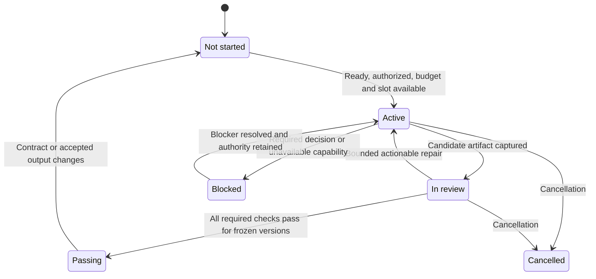

# Nexestra architecture and acceptance

The first diagram describes implemented Work Briefs. Other diagrams describe the target control plane and are not implementation claims.

## Implemented: shared work brief

```mermaid
flowchart LR
  human["User&#58; chat or Work Briefs"]
  api["Scoped HTTP commands"]
  store["FileStore&#58; revision checks and fsync"]
  journal["Canonical thread JSONL"]
  dispatcher["Mention dispatcher"]
  runtime["Codex / OpenCode / custom HTTP"]
  tools["Master read_brief and draft_brief"]
  human -->|Read, save, confirm scope| api
  api -->|Validated commands| store
  store -->|Append revisions| journal
  human -->|Explicit mention| dispatcher
  store -->|Current brief| dispatcher
  dispatcher -->|Pinned invocation context| runtime
  runtime -->|Custom Master only| tools
  tools -->|Same scoped commands| store
%% portable-canonical-v2:eyJhY2Nlc3NpYmlsaXR5IjpudWxsLCJkYXRhIjp7ImRpcmVjdGlvbiI6IkxSIiwiZWRnZXMiOlt7ImZyb20iOiJodW1hbiIsImxhYmVsIjoiUmVhZCwgc2F2ZSwgY29uZmlybSBzY29wZSIsInRvIjoiYXBpIn0seyJmcm9tIjoiYXBpIiwibGFiZWwiOiJWYWxpZGF0ZWQgY29tbWFuZHMiLCJ0byI6InN0b3JlIn0seyJmcm9tIjoic3RvcmUiLCJsYWJlbCI6IkFwcGVuZCByZXZpc2lvbnMiLCJ0byI6ImpvdXJuYWwifSx7ImZyb20iOiJodW1hbiIsImxhYmVsIjoiRXhwbGljaXQgbWVudGlvbiIsInRvIjoiZGlzcGF0Y2hlciJ9LHsiZnJvbSI6InN0b3JlIiwibGFiZWwiOiJDdXJyZW50IGJyaWVmIiwidG8iOiJkaXNwYXRjaGVyIn0seyJmcm9tIjoiZGlzcGF0Y2hlciIsImxhYmVsIjoiUGlubmVkIGludm9jYXRpb24gY29udGV4dCIsInRvIjoicnVudGltZSJ9LHsiZnJvbSI6InJ1bnRpbWUiLCJsYWJlbCI6IkN1c3RvbSBNYXN0ZXIgb25seSIsInRvIjoidG9vbHMifSx7ImZyb20iOiJ0b29scyIsImxhYmVsIjoiU2FtZSBzY29wZWQgY29tbWFuZHMiLCJ0byI6InN0b3JlIn1dLCJub2RlcyI6W3siaWQiOiJodW1hbiIsImxhYmVsIjoiVXNlcjogY2hhdCBvciBXb3JrIEJyaWVmcyJ9LHsiaWQiOiJhcGkiLCJsYWJlbCI6IlNjb3BlZCBIVFRQIGNvbW1hbmRzIn0seyJpZCI6InN0b3JlIiwibGFiZWwiOiJGaWxlU3RvcmU6IHJldmlzaW9uIGNoZWNrcyBhbmQgZnN5bmMifSx7ImlkIjoiam91cm5hbCIsImxhYmVsIjoiQ2Fub25pY2FsIHRocmVhZCBKU09OTCJ9LHsiaWQiOiJkaXNwYXRjaGVyIiwibGFiZWwiOiJNZW50aW9uIGRpc3BhdGNoZXIifSx7ImlkIjoicnVudGltZSIsImxhYmVsIjoiQ29kZXggLyBPcGVuQ29kZSAvIGN1c3RvbSBIVFRQIn0seyJpZCI6InRvb2xzIiwibGFiZWwiOiJNYXN0ZXIgcmVhZF9icmllZiBhbmQgZHJhZnRfYnJpZWYifV19LCJkZXNjcmlwdGlvbiI6bnVsbCwiaWQiOiJjdXJyZW50LWJyaWVmIiwia2luZCI6ImZsb3djaGFydCIsInNvdXJjZVNoYTI1NiI6IjMxNzBjMmNiYzcyYzgzN2ViN2VmOWIzNTQ3ZDNkNjM4NzJmYjQxMzkzOTkwMzNjOTVhOTZhZjdmZjdhMjYyYWQiLCJzdHlsZXMiOltdLCJ0aXRsZSI6IkltcGxlbWVudGVkOiBzaGFyZWQgd29yayBicmllZiIsInZlcnNpb24iOjF9
```

<!-- mermaid:id=current-brief -->

## Target: control plane and independent acceptance

```mermaid
flowchart LR
  user["User"]
  surfaces["Chat and extensible surfaces"]
  coordinator["Intent and planning assistant"]
  commands["Domain commands and policy"]
  scheduler["Durable scheduler&#58; budget, WIP, stop policy"]
  adapters["Configured agent runtimes"]
  artifacts["Versioned candidate artifacts"]
  verifier["Independent verification"]
  state["Canonical state, evidence and checkpoints"]
  user -->|Intent and decisions| surfaces
  surfaces -->|Revisioned actions| commands
  coordinator -->|Proposals| commands
  commands -->|Authorized work| scheduler
  scheduler -->|Scoped invocation| adapters
  adapters -->|Candidate output| artifacts
  artifacts -->|Frozen versions| verifier
  verifier -->|Evidence and repair result| commands
  commands -->|Durable transitions| state
  state -->|Projections| surfaces
  state -->|Bounded relevant context| coordinator
%% portable-canonical-v2:eyJhY2Nlc3NpYmlsaXR5IjpudWxsLCJkYXRhIjp7ImRpcmVjdGlvbiI6IkxSIiwiZWRnZXMiOlt7ImZyb20iOiJ1c2VyIiwibGFiZWwiOiJJbnRlbnQgYW5kIGRlY2lzaW9ucyIsInRvIjoic3VyZmFjZXMifSx7ImZyb20iOiJzdXJmYWNlcyIsImxhYmVsIjoiUmV2aXNpb25lZCBhY3Rpb25zIiwidG8iOiJjb21tYW5kcyJ9LHsiZnJvbSI6ImNvb3JkaW5hdG9yIiwibGFiZWwiOiJQcm9wb3NhbHMiLCJ0byI6ImNvbW1hbmRzIn0seyJmcm9tIjoiY29tbWFuZHMiLCJsYWJlbCI6IkF1dGhvcml6ZWQgd29yayIsInRvIjoic2NoZWR1bGVyIn0seyJmcm9tIjoic2NoZWR1bGVyIiwibGFiZWwiOiJTY29wZWQgaW52b2NhdGlvbiIsInRvIjoiYWRhcHRlcnMifSx7ImZyb20iOiJhZGFwdGVycyIsImxhYmVsIjoiQ2FuZGlkYXRlIG91dHB1dCIsInRvIjoiYXJ0aWZhY3RzIn0seyJmcm9tIjoiYXJ0aWZhY3RzIiwibGFiZWwiOiJGcm96ZW4gdmVyc2lvbnMiLCJ0byI6InZlcmlmaWVyIn0seyJmcm9tIjoidmVyaWZpZXIiLCJsYWJlbCI6IkV2aWRlbmNlIGFuZCByZXBhaXIgcmVzdWx0IiwidG8iOiJjb21tYW5kcyJ9LHsiZnJvbSI6ImNvbW1hbmRzIiwibGFiZWwiOiJEdXJhYmxlIHRyYW5zaXRpb25zIiwidG8iOiJzdGF0ZSJ9LHsiZnJvbSI6InN0YXRlIiwibGFiZWwiOiJQcm9qZWN0aW9ucyIsInRvIjoic3VyZmFjZXMifSx7ImZyb20iOiJzdGF0ZSIsImxhYmVsIjoiQm91bmRlZCByZWxldmFudCBjb250ZXh0IiwidG8iOiJjb29yZGluYXRvciJ9XSwibm9kZXMiOlt7ImlkIjoidXNlciIsImxhYmVsIjoiVXNlciJ9LHsiaWQiOiJzdXJmYWNlcyIsImxhYmVsIjoiQ2hhdCBhbmQgZXh0ZW5zaWJsZSBzdXJmYWNlcyJ9LHsiaWQiOiJjb29yZGluYXRvciIsImxhYmVsIjoiSW50ZW50IGFuZCBwbGFubmluZyBhc3Npc3RhbnQifSx7ImlkIjoiY29tbWFuZHMiLCJsYWJlbCI6IkRvbWFpbiBjb21tYW5kcyBhbmQgcG9saWN5In0seyJpZCI6InNjaGVkdWxlciIsImxhYmVsIjoiRHVyYWJsZSBzY2hlZHVsZXI6IGJ1ZGdldCwgV0lQLCBzdG9wIHBvbGljeSJ9LHsiaWQiOiJhZGFwdGVycyIsImxhYmVsIjoiQ29uZmlndXJlZCBhZ2VudCBydW50aW1lcyJ9LHsiaWQiOiJhcnRpZmFjdHMiLCJsYWJlbCI6IlZlcnNpb25lZCBjYW5kaWRhdGUgYXJ0aWZhY3RzIn0seyJpZCI6InZlcmlmaWVyIiwibGFiZWwiOiJJbmRlcGVuZGVudCB2ZXJpZmljYXRpb24ifSx7ImlkIjoic3RhdGUiLCJsYWJlbCI6IkNhbm9uaWNhbCBzdGF0ZSwgZXZpZGVuY2UgYW5kIGNoZWNrcG9pbnRzIn1dfSwiZGVzY3JpcHRpb24iOm51bGwsImlkIjoidGFyZ2V0LWNvbnRyb2wtcGxhbmUiLCJraW5kIjoiZmxvd2NoYXJ0Iiwic291cmNlU2hhMjU2IjoiOWIzZGRjZjExMTU4ZmEzNTVkODk3ZjEwOGQwMTQ3ZTYwYjgwMTMyZWVmMTgyZTgyNTgwNjg0ZmJiZGZhZDYzOCIsInN0eWxlcyI6W10sInRpdGxlIjoiVGFyZ2V0OiBjb250cm9sIHBsYW5lIGFuZCBpbmRlcGVuZGVudCBhY2NlcHRhbmNlIiwidmVyc2lvbiI6MX0
```

<!-- mermaid:id=target-control-plane -->

## Target: acceptance lifecycle, separate from run status

<!-- mermaid:id=target-lifecycle -->

