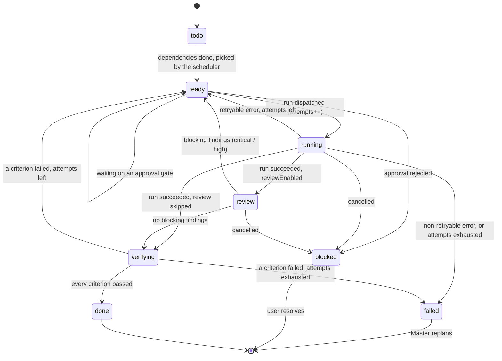
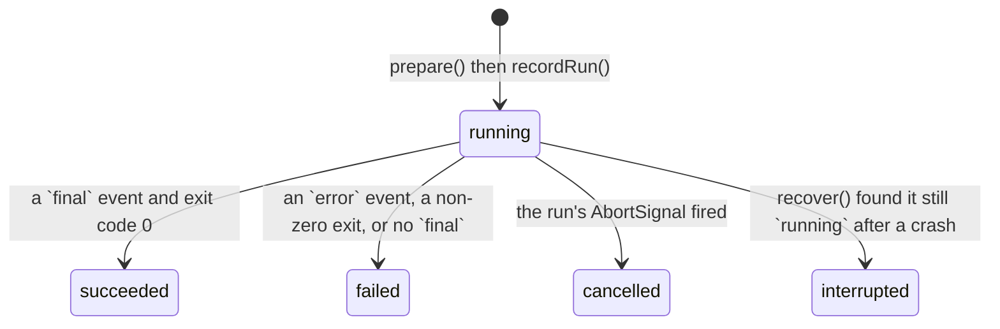
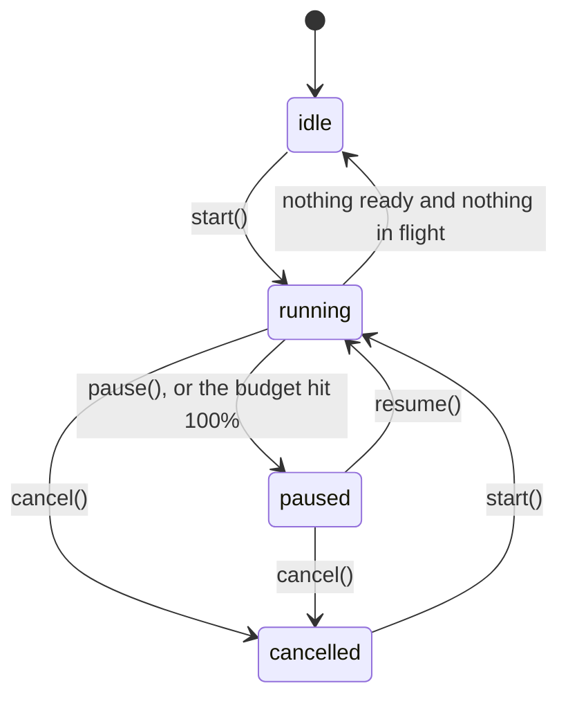

# The orchestration engine (`@nexestra/orchestrator`)

Milestone M5. The orchestrator turns a `Plan` into harness runs: it schedules
ready tasks over the DAG, gives each one a git worktree, cross-reviews the
result with a second harness, proves the acceptance criteria by running them,
retries with the failure attached, and asks the Master to replan when the
attempts run out.

It is a **library**, not a service: no HTTP, no routes, no Master. Three seams
keep it that way.

| Seam | Interface | Real implementation | Test implementation |
|------|-----------|---------------------|---------------------|
| The harnesses | `HarnessAdapter` | `@nexestra/adapter-codex`, `@nexestra/adapter-opencode` | `createFakeHarnessAdapter()` |
| The Master | `MasterBridge` | `apps/server`, on top of a `MasterSession` | a recorder in the tests |
| The world | `NexestraStore` | `@nexestra/storage` | the same store on a temp `NEXESTRA_HOME` |

Because all three are injected, the whole loop — scheduling, retry, review,
verification, approvals, budget, merge, recovery — runs in Vitest against a
temp git repo with no harness installed and no API key. One opt-in live test
drives the real Codex CLI end to end.

---

## 1. Quick start

```ts
import { createCodexAdapter } from "@nexestra/adapter-codex";
import { createStore } from "@nexestra/storage";
import { createOrchestrator } from "@nexestra/orchestrator";

const orchestrator = createOrchestrator({
  store: createStore(),
  adapters: { codex: createCodexAdapter(), opencode: createOpenCodeAdapter() },
  master: bridge,                                   // your MasterBridge
  config: {
    worktreeRoot: "/Users/me/repo/.nexestra/worktrees",
    concurrency: 2,
    autoMerge: false,
    budgetUSD: 20,
    priceTable: { "gpt-5.1-codex": { inputPerMTok: 1.25, outputPerMTok: 10 } },
  },
});

await orchestrator.recover(threadId);   // repair anything a crash left behind
await orchestrator.start(threadId);     // returns immediately; the loop runs on
await orchestrator.drain(threadId);     // …resolve when the thread goes idle
```

### Public API

| Member | Purpose |
|--------|---------|
| `start(threadId)` | Begin scheduling. Returns the status **immediately**; the loop keeps running. |
| `pause(threadId)` | Stop dispatching. Runs already in flight finish. |
| `resume(threadId)` | Undo a pause and schedule again. |
| `cancel(threadId)` | Abort every live run through `adapter.control(runId, {action:"cancel"})` and stop. |
| `dispatch(taskId, opts?)` | Start one task. Resolves as soon as its first `Run` row exists. |
| `controlRun(runId, action)` | `pause` / `resume` / `cancel` / `steer` a live run. |
| `runVerification(taskId, criterionIds?)` | Run the task's acceptance criteria now and record evidence. |
| `recover(threadId)` | Mark interrupted runs, reset their tasks, prune stale worktrees. |
| `status(threadId)` | Synchronous `OrchestratorStatus`. |
| `drain(threadId)` | Resolve once the thread has nothing left to do. |
| `close()` | Cancel every thread and release the engines. |
| `host` | The `ExecutionHost` the Master's host delegates to. |

`dispatch(taskId)` with no `kind` (or `kind: "execute"`) runs the **whole**
pipeline for that task. `kind: "review"` or `"verify"` runs a single run of
that kind, which is what the Master's `dispatch_task` tool asks for.

---

## 2. State machines

### 2.1 Task



`done` carries a `mergeState`:

| `mergeState` | Meaning |
|--------------|---------|
| *(unset)* | The task produced no commit — nothing to merge. |
| `merged` | `autoMerge` landed the branch on the base branch. |
| `pending` | Verified and committed; a `merge` Approval is waiting. |
| `conflict` | The automatic merge conflicted, was aborted, and raised a `merge` Approval. |

### 2.2 Run



### 2.3 Thread (the loop's own state, **not** `Thread.phase`)



The orchestrator **never writes `Thread.phase`.** The phase machine belongs to
the Master (`docs/master.md` §3); the loop reports a `thread_idle` notification
carrying an outcome and lets the server turn that into
`session.applyTrigger("all_tasks_done" | "blocked" | …)`.

---

## 3. The loop, step by step

Per PLAN.md §6, for each task the scheduler releases:

1. **Ready** — every `dependsOn` is `done`, the task is `todo` or `ready`, and
   fewer than `concurrency` pipelines are in flight. Ties break on
   `Task.order`, then `createdAt`.
2. **Worktree** — `ensureWorktree(repo, "nexestra/<threadId>/<taskId>",
   "<worktreeRoot>/<threadId>/<taskId>")`, cut from the workspace's default
   branch. Idempotent, so a resumed task finds the same tree.
   `HarnessConfig.worktreePath` / `.branch` override the derived names.
3. **Instructions** — task title and description, the thread's goal, scope and
   constraints, the linked acceptance criteria *with their verification
   commands*, and — on a retry — "the previous attempt failed because…", the
   blocking review findings, and the failing verification output.
4. **Gate** — a run asking for `danger-full-access`, or for an MCP server (or a
   tool) the configuration does not allow-list, creates an Approval and waits.
   A rejection puts the task in `blocked` and nothing is spawned.
5. **Execute** — `prepare()`, then every `HarnessEvent` is appended with
   `appendRunEvent`. `attempts` increments before the run starts, so a crash
   mid-run still counts.
6. **Retry** — a `retryable` error retries up to
   `min(task.maxAttempts, config.maxAttempts)`. A non-retryable one does not.
   Exhausting the attempts sets `failed` and calls
   `MasterBridge.requestReplan(taskId, reason, evidence)`.
7. **Review** — if a harness *other than* the executor is registered, a
   read-only `kind: "review"` run looks at the uncommitted diff. Findings of
   severity `critical` or `high` are blocking: the task goes back to execute
   with them attached. A review that fails to run is a warning, not a task
   failure — verification is the gate that decides.
8. **Verify** — each linked criterion runs **in the worktree**:
   `command` / `test` through `execa` with a shell, a timeout and captured
   output; `manual_review` raises a `manual_verification` Approval and waits.
   Every criterion produces an evidence artifact, and the outcomes are written
   back onto the spec in a single version bump.
9. **Commit and merge** — the worktree is committed onto its branch
   (excluding `.nexestra`). With `autoMerge` the branch lands on the base
   branch (fast-forward, else a merge commit); a conflict is aborted and
   raises a `merge` Approval. Without `autoMerge` the task is `done` with
   `mergeState: "pending"` and a `merge` Approval waiting. Merges are
   serialised behind a queue.

Cancellation is honoured at every await: `cancel()` aborts the engine's signal,
which every run's signal is chained to, and calls `adapter.control(runId,
{action: "cancel"})` on each live run.

---

## 4. Configuration

| Option | Default | Notes |
|--------|---------|-------|
| `worktreeRoot` | **required** | Worktrees live at `<root>/<threadId>/<taskId>` |
| `concurrency` | `2` | Task pipelines in flight per thread |
| `maxAttempts` | `3` | A **ceiling** over `Task.maxAttempts` |
| `reviewEnabled` | `true` | Needs a second harness to do anything |
| `verifyEnabled` | `true` | |
| `autoMerge` | `false` | PLAN.md §10.2: approval by default |
| `budgetUSD` | `Thread.budgetUSD` | 80% → `spend` approval, 100% → pause |
| `priceTable` | `{}` | Per-model USD per MTok; an unknown model costs **zero** |
| `runTimeoutMs` | `900000` | Fallback when `HarnessConfig.timeoutMs` is absent |
| `verificationTimeoutMs` | `600000` | Per criterion |
| `maxArtifactBytes` | `1 MiB` | Longer artifacts are truncated with a marker |
| `baseBranch` | `Workspace.defaultBranch` | Branch point and merge target |
| `allowedMcpServers` | `[]` | Anything else raises a `permission` Approval |
| `allowedTools` | *(unset — all allowed)* | Set it to switch tools to deny-by-default |
| `env` | `{}` | Overlaid on verification commands |
| `commitIdentity` | `nexestra <nexestra@local>` | Used for the worktree commit and the merge |
| `now`, `logger` | injectable | |

---

## 5. Interfaces

### 5.1 `MasterBridge` — what the loop needs from the Master

```ts
interface MasterBridge {
  requestReplan(taskId: string, reason: string, evidence: ReplanEvidence): void | Promise<void>;
  notify(event: OrchestratorEvent): void | Promise<void>;
}
```

Both may reject; a rejection is logged and never stalls the loop.

`ReplanEvidence` carries `attempts`, `maxAttempts`, every `runId` and
`artifactId` the task produced, the `lastError`, the blocking `reviewFindings`
and the `verification` outcomes — enough for the Master's `replan` tool to
decide whether to split the task, change the harness, or change the model.

`OrchestratorEvent` is a discriminated union:

| `type` | When |
|--------|------|
| `thread_started`, `thread_idle` | `start()`; nothing left to do (`outcome`: completed / failed / blocked / cancelled / budget_exceeded) |
| `task_status` | Any task status change (`from`, `to`) |
| `run_started`, `run_ended` | Around every harness run |
| `run_retrying` | A retry is about to happen, with the reason |
| `review_findings` | A review run produced findings; `blocking` counts the severe ones |
| `verification_completed` | All requested criteria have run |
| `approval_requested`, `approval_resolved` | Around every gate |
| `replan_requested` | Just before `requestReplan` |
| `budget_warning`, `budget_exceeded` | 80% and 100% of the budget |
| `merge` | `merged` / `pending_approval` / `conflict` |
| `error` | A pipeline crashed |

### 5.2 `ExecutionHost` — what the Master needs from the loop

```ts
interface ExecutionHost {
  dispatchTask(input): Promise<{runId, taskId, harness, kind, worktreePath?}>;
  readRunEvents(input): Promise<{runId, events[{seq, type, payload}], nextSeq, truncated}>;
  readArtifact(input): Promise<{artifact{id, kind, title}, content, truncated}>;
  controlRun(input): Promise<{ok, note?}>;
  runVerification(input): Promise<{taskId, outcomes[…]}>;
  markCriterion(input): Promise<{criterionId, satisfied}>;
}
```

These are the six execution callbacks of `MasterHost` (`docs/master.md` §4),
declared **structurally** rather than imported, so `@nexestra/orchestrator`
does not depend on `@nexestra/master`. The server's host object spreads them in
and implements only the read tools itself.

`markCriterion` refuses to satisfy a criterion without an
`evidenceArtifactId`, matching the Master's own gate.
`runVerification` through the host does **not** wait on a `manual_review`
approval — it raises the approval and reports the criterion as not yet passed,
so a Master turn cannot hang on a human. The pipeline does wait.

---

## 6. Event and artifact conventions

Everything the loop does is written through `NexestraStore`, so the existing
`/ws` fan-out carries it to the UI with no extra wiring.

| Store command | Event | Written when |
|---------------|-------|--------------|
| `recordRun` | `run.recorded` | Run start and run end (same row, upserted) |
| `appendRunEvent` | `run.event_appended` | Every single `HarnessEvent`, `seq` assigned by the loop |
| `recordArtifact` | `artifact.recorded` | Every artifact below |
| `updateTask` | `task.status_changed` / `task.updated` | Status, `attempts`, `costUSD`, `mergeState` |
| `updateThread` | `thread.updated` | `costUSD` only — never `phase` |
| `upsertSpec` | `spec.upserted` | Verification evidence folded onto the criteria |
| `createApproval` / `resolveApproval` | `approval.requested` / `approval.resolved` | Every gate |

### Artifacts

Bytes are written to `<dataDir>/<threadId>/<artifactId>.<ext>` — exactly where
`GET /api/artifacts/:id/content` reads them from — and the row keeps a 2000
character preview.

| Kind | Title | Content |
|------|-------|---------|
| `diff` | `Diff — <task> (attempt N)` | The real `git diff` of the worktree, untracked files included, `.nexestra` excluded |
| `log` | `Harness output — <task> (<kind>)` | `final.message`, plus the error and exit code when the run failed |
| `log` | `Commands — <task> (<kind>)` | Every `command` event: argv, exit code, stdout, stderr |
| `review` | `Review findings — <task> (attempt N)` | `{summary, findings[]}` JSON |
| `test_report` / `log` | `Verification pass\|fail — <criterionId>` | Criterion, command, exit code, duration, stdout, stderr |
| `log` | `Manual verification — <criterionId>` | The instructions, the approval id and its resolution |

### Approvals

| `kind` | Raised when |
|--------|-------------|
| `sandbox_escalation` | The run asks for `danger-full-access` |
| `permission` | An MCP server or tool outside the allow-list, or a mid-run `permission_request` event |
| `spend` | The thread passed 80% of its budget (once per engine) |
| `merge` | A verified task is ready to land, or an automatic merge conflicted |
| `manual_verification` | A criterion whose `verification.kind` is `manual_review` |

The loop waits by subscribing to the store's own `approval.resolved` event, so
anything that resolves the row — the REST route, the UI, a test — releases it.

---

## 7. How `apps/server` should wire it

1. **One orchestrator per process**, built from the process-wide store and the
   adapters that `discover()` reported as available:

   ```ts
   const orchestrator = createOrchestrator({ store, adapters, master: bridge, config });
   ```

2. **`MasterBridge` on top of the Master session.** `notify` forwards to the
   WebSocket and translates the interesting events into phase triggers:

   ```ts
   const bridge: MasterBridge = {
     notify(event) {
       if (event.type === "thread_idle") {
         session(event.threadId).applyTrigger(
           event.outcome === "completed" ? "all_tasks_done" : "blocked",
         );
       }
     },
     async requestReplan(taskId, reason, evidence) {
       for await (const _ of session(threadId).send({
         kind: "continue",
         note: `Task ${taskId} failed: ${reason}`,
       })) { /* forward */ }
     },
   };
   ```

3. **`MasterHost` delegates the execution half:**

   ```ts
   const host: MasterHost = {
     ...createFsWorkspaceReader({ root: workspace.rootPath }),
     recordMemory, requestApproval, summarize,          // server's own
     dispatchTask: orchestrator.host.dispatchTask,
     readRunEvents: orchestrator.host.readRunEvents,
     readArtifact: orchestrator.host.readArtifact,
     controlRun: orchestrator.host.controlRun,
     runVerification: orchestrator.host.runVerification,
     markCriterion: orchestrator.host.markCriterion,
   };
   ```

4. **`recover()` every active thread at startup**, before serving traffic, and
   `close()` on `SIGINT`/`SIGTERM`.

5. **Routes**: `POST /api/threads/:id/start|pause|resume|cancel`,
   `POST /api/tasks/:id/dispatch`, `POST /api/runs/:id/control`,
   `POST /api/tasks/:id/verify`. Everything they change already reaches the UI
   as store events — the routes only need to answer with `status(threadId)`.

6. **Nothing else has to broadcast.** The loop writes through the store, the
   store emits, `ws.ts` fans out.

---

## 8. Tests

`pnpm --filter @nexestra/orchestrator test` — 52 tests, a temp git repo and a
temp store per test, no harness and no key.

| File | Covers |
|------|--------|
| `src/units.test.ts` | ready-task selection, prompt composition, `buildRunSpec`, review normalisation, the approval gate, pricing and budget levels, the verification runner (exit codes, `expectStdoutMatch`, `testPath`, timeouts) |
| `src/orchestrator.test.ts` | the M5 acceptance run: a four-task DAG two at a time; retry / no-retry / replan; a cross-review bounce; a failing criterion that retries and passes with both evidence artifacts; approval gates that block and resume; the budget approval and pause; autoMerge, pending-merge and a real conflict; `recover()` after a simulated crash; cancel mid-run; the `ExecutionHost` |
| `src/live.test.ts` | one real Codex run through the whole loop, behind `NEXESTRA_LIVE_CODEX=1` |

`createFakeHarnessAdapter()` scripts a run per `(taskId, kind, attempt)`: it
writes real files into the worktree so `git diff` and the verification commands
see real changes, reports usage, honours `AbortSignal`, and ends a cancelled
run the way `codex exec` does — an `error` then an `ended`, with no `final`.

### The live test

```bash
NEXESTRA_LIVE_CODEX=1 pnpm --filter @nexestra/orchestrator test
```

A one-task plan on a throwaway repo: Codex creates `hello.txt` in the worktree,
the orchestrator proves it with `test -f hello.txt`, records the evidence, folds
it onto the spec criterion and fast-forwards the branch onto `main`.

---

## 9. Known gaps

- **Not wired up yet.** `apps/server` does not import this package; §7 is the
  plan, not the state.
- **`pause()` does not suspend a live run.** It stops dispatching; the runs in
  flight finish. Suspending mid-run needs `codex app-server`, which the Codex
  adapter does not use yet.
- **Usage events are treated as increments.** A harness that reports cumulative
  totals per turn would over-count; Codex emits one `token_count` per turn, so
  this is correct today and worth revisiting per adapter.
- **The budget warning does not suspend**, matching the Master: 80% raises an
  approval and the loop keeps going; only 100% pauses.
- **One process owns the store.** The approval wait listens to the in-process
  `EventStore` fan-out, so a second process resolving an approval in the same
  SQLite file would not release the waiter.
- **`recover()` is per thread.** There is no "recover everything" sweep; the
  server has to enumerate its active threads.
- **Merge is a plain `git merge`.** No rebase strategy, no auto-resolution, and
  the base branch must be checked out and clean or the merge is refused
  (`unavailable`) and turned into an Approval.
